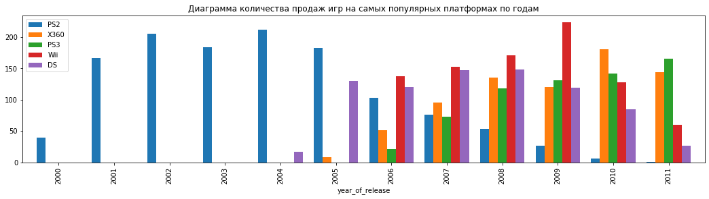
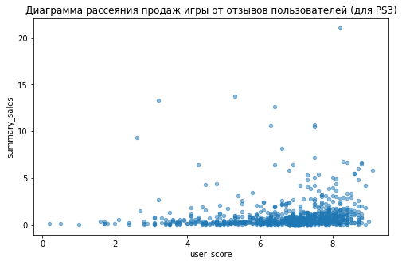

# Введение

Были предоставлены данные (возможно, неполные) о продажах компьютерных игр, их жанров, платформ выпуска и оценок пользователей и экспертов за 2016 год. Целью проекта является подготовка и анализ имеющихся данных для планирования рекламных кампаний интернет-магазина на 2017 год.

Для достижения цели проекта предстоит выполнить следующие задачи:

1. Считать и проанализировать данные на пропуски, дубликаты, и.т.д.

2. Привести названия столбцов к правильному виду, преобразовать данные в нужные типы, заполнить пропуски (там, где это нужно/возможно), избавиться от явных и неявных дубликатов (при наличии). Также на этапе предобработки требуется добавить столбец с суммарными продажами игр во всех регионах.

3. Проанализировать данные:

* Определить, как распределены игры по году выпуска, выбрать актуальный период (который следует учитывать при планировании следующего года).

* Проанализировать распределение продаж игр по различным платформам, выбрать лидеров, а также растущие и потенциально прибыльные платформы.

* Посмотреть на зависимость продаж от отзывов пользователей и критиков.

* Проанализировать распределение игр по жанрам, сделать вывод о самых прибыльных жанрах.

4. Составить портреты пользователей по регионам: для каждого региона определить самые популярные платформы и жанры. Также проанализировать влияние рейтинга ESRB (*Entertainment Software Rating Board*) на продажи в каждом регионе.

5. Проверить гипотезы:

* Средние пользовательские рейтинги платформ Xbox One и PC одинаковые

* Средние пользовательские рейтинги жанров Action и Sports разные

# Получение и анализ данных

## Получение данных


```python
# импорт необходимых библиотек
import pandas as pd
import numpy as np
import matplotlib.pyplot as plt
import scipy.stats as st
import seaborn as sb
```


```python
# считывание и просмотр данных
pd.options.mode.chained_assignment = None
data = pd.read_csv('/datasets/games.csv')
display(data.head())
data.info()
```


<div>

<table border="1" class="dataframe">
  <thead>
    <tr style="text-align: right;">
      <th></th>
      <th>Name</th>
      <th>Platform</th>
      <th>Year_of_Release</th>
      <th>Genre</th>
      <th>NA_sales</th>
      <th>EU_sales</th>
      <th>JP_sales</th>
      <th>Other_sales</th>
      <th>Critic_Score</th>
      <th>User_Score</th>
      <th>Rating</th>
    </tr>
  </thead>
  <tbody>
    <tr>
      <th>0</th>
      <td>Wii Sports</td>
      <td>Wii</td>
      <td>2006.0</td>
      <td>Sports</td>
      <td>41.36</td>
      <td>28.96</td>
      <td>3.77</td>
      <td>8.45</td>
      <td>76.0</td>
      <td>8</td>
      <td>E</td>
    </tr>
    <tr>
      <th>1</th>
      <td>Super Mario Bros.</td>
      <td>NES</td>
      <td>1985.0</td>
      <td>Platform</td>
      <td>29.08</td>
      <td>3.58</td>
      <td>6.81</td>
      <td>0.77</td>
      <td>NaN</td>
      <td>NaN</td>
      <td>NaN</td>
    </tr>
    <tr>
      <th>2</th>
      <td>Mario Kart Wii</td>
      <td>Wii</td>
      <td>2008.0</td>
      <td>Racing</td>
      <td>15.68</td>
      <td>12.76</td>
      <td>3.79</td>
      <td>3.29</td>
      <td>82.0</td>
      <td>8.3</td>
      <td>E</td>
    </tr>
    <tr>
      <th>3</th>
      <td>Wii Sports Resort</td>
      <td>Wii</td>
      <td>2009.0</td>
      <td>Sports</td>
      <td>15.61</td>
      <td>10.93</td>
      <td>3.28</td>
      <td>2.95</td>
      <td>80.0</td>
      <td>8</td>
      <td>E</td>
    </tr>
    <tr>
      <th>4</th>
      <td>Pokemon Red/Pokemon Blue</td>
      <td>GB</td>
      <td>1996.0</td>
      <td>Role-Playing</td>
      <td>11.27</td>
      <td>8.89</td>
      <td>10.22</td>
      <td>1.00</td>
      <td>NaN</td>
      <td>NaN</td>
      <td>NaN</td>
    </tr>
  </tbody>
</table>
</div>


    <class 'pandas.core.frame.DataFrame'>
    RangeIndex: 16715 entries, 0 to 16714
    Data columns (total 11 columns):
     #   Column           Non-Null Count  Dtype  
    ---  ------           --------------  -----  
     0   Name             16713 non-null  object 
     1   Platform         16715 non-null  object 
     2   Year_of_Release  16446 non-null  float64
     3   Genre            16713 non-null  object 
     4   NA_sales         16715 non-null  float64
     5   EU_sales         16715 non-null  float64
     6   JP_sales         16715 non-null  float64
     7   Other_sales      16715 non-null  float64
     8   Critic_Score     8137 non-null   float64
     9   User_Score       10014 non-null  object 
     10  Rating           9949 non-null   object 
    dtypes: float64(6), object(5)
    memory usage: 1.4+ MB


Мы видим базу данных с 11 столбцами, 16715 строками и следующими проблемами, которые следует исправить на этапе предобработки:

* Нетипизированное название столбцов (присутствуют заглавные буквы)

* Пропуски в данных в некоторых столбцах

* Некорректный тип столбцов (*Year_of_Release*, *Critic_Score*, *User_Score*)

#  Предобработка данных

## Изменение названий столбцов

Приведем названия столбцов к нижнему регистру


```python
data = data.rename(str.lower, axis = 'columns')
data
```


<div>

<table border="1" class="dataframe">
  <thead>
    <tr style="text-align: right;">
      <th></th>
      <th>name</th>
      <th>platform</th>
      <th>year_of_release</th>
      <th>genre</th>
      <th>na_sales</th>
      <th>eu_sales</th>
      <th>jp_sales</th>
      <th>other_sales</th>
      <th>critic_score</th>
      <th>user_score</th>
      <th>rating</th>
    </tr>
  </thead>
  <tbody>
    <tr>
      <th>0</th>
      <td>Wii Sports</td>
      <td>Wii</td>
      <td>2006.0</td>
      <td>Sports</td>
      <td>41.36</td>
      <td>28.96</td>
      <td>3.77</td>
      <td>8.45</td>
      <td>76.0</td>
      <td>8</td>
      <td>E</td>
    </tr>
    <tr>
      <th>1</th>
      <td>Super Mario Bros.</td>
      <td>NES</td>
      <td>1985.0</td>
      <td>Platform</td>
      <td>29.08</td>
      <td>3.58</td>
      <td>6.81</td>
      <td>0.77</td>
      <td>NaN</td>
      <td>NaN</td>
      <td>NaN</td>
    </tr>
    <tr>
      <th>2</th>
      <td>Mario Kart Wii</td>
      <td>Wii</td>
      <td>2008.0</td>
      <td>Racing</td>
      <td>15.68</td>
      <td>12.76</td>
      <td>3.79</td>
      <td>3.29</td>
      <td>82.0</td>
      <td>8.3</td>
      <td>E</td>
    </tr>
    <tr>
      <th>3</th>
      <td>Wii Sports Resort</td>
      <td>Wii</td>
      <td>2009.0</td>
      <td>Sports</td>
      <td>15.61</td>
      <td>10.93</td>
      <td>3.28</td>
      <td>2.95</td>
      <td>80.0</td>
      <td>8</td>
      <td>E</td>
    </tr>
    <tr>
      <th>4</th>
      <td>Pokemon Red/Pokemon Blue</td>
      <td>GB</td>
      <td>1996.0</td>
      <td>Role-Playing</td>
      <td>11.27</td>
      <td>8.89</td>
      <td>10.22</td>
      <td>1.00</td>
      <td>NaN</td>
      <td>NaN</td>
      <td>NaN</td>
    </tr>
    <tr>
      <th>...</th>
      <td>...</td>
      <td>...</td>
      <td>...</td>
      <td>...</td>
      <td>...</td>
      <td>...</td>
      <td>...</td>
      <td>...</td>
      <td>...</td>
      <td>...</td>
      <td>...</td>
    </tr>
    <tr>
      <th>16710</th>
      <td>Samurai Warriors: Sanada Maru</td>
      <td>PS3</td>
      <td>2016.0</td>
      <td>Action</td>
      <td>0.00</td>
      <td>0.00</td>
      <td>0.01</td>
      <td>0.00</td>
      <td>NaN</td>
      <td>NaN</td>
      <td>NaN</td>
    </tr>
    <tr>
      <th>16711</th>
      <td>LMA Manager 2007</td>
      <td>X360</td>
      <td>2006.0</td>
      <td>Sports</td>
      <td>0.00</td>
      <td>0.01</td>
      <td>0.00</td>
      <td>0.00</td>
      <td>NaN</td>
      <td>NaN</td>
      <td>NaN</td>
    </tr>
    <tr>
      <th>16712</th>
      <td>Haitaka no Psychedelica</td>
      <td>PSV</td>
      <td>2016.0</td>
      <td>Adventure</td>
      <td>0.00</td>
      <td>0.00</td>
      <td>0.01</td>
      <td>0.00</td>
      <td>NaN</td>
      <td>NaN</td>
      <td>NaN</td>
    </tr>
    <tr>
      <th>16713</th>
      <td>Spirits &amp; Spells</td>
      <td>GBA</td>
      <td>2003.0</td>
      <td>Platform</td>
      <td>0.01</td>
      <td>0.00</td>
      <td>0.00</td>
      <td>0.00</td>
      <td>NaN</td>
      <td>NaN</td>
      <td>NaN</td>
    </tr>
    <tr>
      <th>16714</th>
      <td>Winning Post 8 2016</td>
      <td>PSV</td>
      <td>2016.0</td>
      <td>Simulation</td>
      <td>0.00</td>
      <td>0.00</td>
      <td>0.01</td>
      <td>0.00</td>
      <td>NaN</td>
      <td>NaN</td>
      <td>NaN</td>
    </tr>
  </tbody>
</table>
<p>16715 rows × 11 columns</p>
</div>


##### Работа с пропусками

Из предыдущего пункта можно заметить, что пропуски присутствуют в следующих столбцах: 

* *name*

* *year_of_release*

* *genre*

* *critic_score*

* *user_score*

* *raiting*

В первую очередь посмотрим на строки с пропущенными *name* и *genre* (их всего 2)


```python
display(data[data['name'].isna()])
data = data.query('not name.isna()')
```


<div>

<table border="1" class="dataframe">
  <thead>
    <tr style="text-align: right;">
      <th></th>
      <th>name</th>
      <th>platform</th>
      <th>year_of_release</th>
      <th>genre</th>
      <th>na_sales</th>
      <th>eu_sales</th>
      <th>jp_sales</th>
      <th>other_sales</th>
      <th>critic_score</th>
      <th>user_score</th>
      <th>rating</th>
    </tr>
  </thead>
  <tbody>
    <tr>
      <th>659</th>
      <td>NaN</td>
      <td>GEN</td>
      <td>1993.0</td>
      <td>NaN</td>
      <td>1.78</td>
      <td>0.53</td>
      <td>0.00</td>
      <td>0.08</td>
      <td>NaN</td>
      <td>NaN</td>
      <td>NaN</td>
    </tr>
    <tr>
      <th>14244</th>
      <td>NaN</td>
      <td>GEN</td>
      <td>1993.0</td>
      <td>NaN</td>
      <td>0.00</td>
      <td>0.00</td>
      <td>0.03</td>
      <td>0.00</td>
      <td>NaN</td>
      <td>NaN</td>
      <td>NaN</td>
    </tr>
  </tbody>
</table>
</div>


Как мы видим, это 2 игры без названия и жанра, изданные в 1993 году и не имевшие никаких рекордных продаж. Так что их лучше удалить из датафрейма.

Попробуем найти зависимость возрастного рейтинга от жанра


```python
for i in data['genre'].unique():
    print(i, data[data['genre'] == i]['rating'].unique())
```

    Sports ['E' nan 'E10+' 'T' 'M']
    Platform [nan 'E' 'E10+' 'T' 'M']
    Racing ['E' nan 'T' 'E10+' 'M' 'RP']
    Role-Playing [nan 'T' 'M' 'E' 'E10+']
    Puzzle [nan 'E' 'E10+' 'T']
    Misc ['E' 'E10+' nan 'T' 'K-A' 'M' 'EC']
    Shooter [nan 'M' 'T' 'E10+' 'E']
    Simulation [nan 'E' 'T' 'E10+' 'M']
    Action ['M' nan 'E' 'T' 'E10+' 'AO' 'EC']
    Fighting ['T' nan 'M' 'E10+' 'E']
    Adventure [nan 'M' 'E' 'T' 'E10+' 'EC']
    Strategy [nan 'T' 'K-A' 'E' 'E10+' 'M' 'RP']


Как мы видим, никакой чёткой корреляции нет, так что пропущенные значения возрастного рейтинга не получится заполнить "логически"

В столбце *year* пропусков достаточно мало, их можно заполнить медианным значением по каждой платформе (игры для определенных платформ в основном выпускались в определенные года)


```python
for plat in data['platform'].unique():
    data.loc[((data['platform'] == plat)&(data['year_of_release'].isna())), 'year_of_release'] =\
    data.loc[data['platform'] == plat, 'year_of_release'].median()
data.info()
```

    <class 'pandas.core.frame.DataFrame'>
    Int64Index: 16713 entries, 0 to 16714
    Data columns (total 11 columns):
     #   Column           Non-Null Count  Dtype  
    ---  ------           --------------  -----  
     0   name             16713 non-null  object 
     1   platform         16713 non-null  object 
     2   year_of_release  16713 non-null  float64
     3   genre            16713 non-null  object 
     4   na_sales         16713 non-null  float64
     5   eu_sales         16713 non-null  float64
     6   jp_sales         16713 non-null  float64
     7   other_sales      16713 non-null  float64
     8   critic_score     8137 non-null   float64
     9   user_score       10014 non-null  object 
     10  rating           9949 non-null   object 
    dtypes: float64(6), object(5)
    memory usage: 1.5+ MB


Остальные пропуски же придётся оставить (слишком много пропущенных значений в отзывах пользователей и критиков и возрастном рейтинге)

Возможными причинами пропусков в этих столбцах могут быть:

* Отсутствие отзывов критиков и пользователей на определенную игру

* Отсутствие опции оставления отзывов на игру на какой-то платформе/сайте

* Потеря данных при переносе в датафрейм

## Преобразование типов данных

Следует преобразовать следующие столбцы:

* *year_of_release* - преобразовать из вещественного в целочисленный тип

* *critic_score* - проверить, есть ли в списке значений не целые, если нет, то также привести к целочисленному типу

* *user_score* - посмотреть, почему является object, а не float


```python
data['critic_score'].unique()
```


    array([76., nan, 82., 80., 89., 58., 87., 91., 61., 97., 95., 77., 88.,
           83., 94., 93., 85., 86., 98., 96., 90., 84., 73., 74., 78., 92.,
           71., 72., 68., 62., 49., 67., 81., 66., 56., 79., 70., 59., 64.,
           75., 60., 63., 69., 50., 25., 42., 44., 55., 48., 57., 29., 47.,
           65., 54., 20., 53., 37., 38., 33., 52., 30., 32., 43., 45., 51.,
           40., 46., 39., 34., 35., 41., 36., 28., 31., 27., 26., 19., 23.,
           24., 21., 17., 22., 13.])


Как видно, дробные значения в столбце *critic_score* отсутствуют, так что приводим его к целочисленному типу


```python
data['year_of_release'] = np.floor(pd.to_numeric(data['year_of_release'], errors='coerce')).astype('Int32')
data['critic_score'] = np.floor(pd.to_numeric(data['critic_score'], errors='coerce')).astype('Int32')
data.info()
```

    <class 'pandas.core.frame.DataFrame'>
    Int64Index: 16713 entries, 0 to 16714
    Data columns (total 11 columns):
     #   Column           Non-Null Count  Dtype  
    ---  ------           --------------  -----  
     0   name             16713 non-null  object 
     1   platform         16713 non-null  object 
     2   year_of_release  16713 non-null  Int32  
     3   genre            16713 non-null  object 
     4   na_sales         16713 non-null  float64
     5   eu_sales         16713 non-null  float64
     6   jp_sales         16713 non-null  float64
     7   other_sales      16713 non-null  float64
     8   critic_score     8137 non-null   Int32  
     9   user_score       10014 non-null  object 
     10  rating           9949 non-null   object 
    dtypes: Int32(2), float64(4), object(5)
    memory usage: 1.4+ MB


Теперь посмотрим на значения столбца *user_score*


```python
print(data['user_score'].unique())
data[data['user_score'] == 'tbd']['user_score'].count()
```

    ['8' nan '8.3' '8.5' '6.6' '8.4' '8.6' '7.7' '6.3' '7.4' '8.2' '9' '7.9'
     '8.1' '8.7' '7.1' '3.4' '5.3' '4.8' '3.2' '8.9' '6.4' '7.8' '7.5' '2.6'
     '7.2' '9.2' '7' '7.3' '4.3' '7.6' '5.7' '5' '9.1' '6.5' 'tbd' '8.8' '6.9'
     '9.4' '6.8' '6.1' '6.7' '5.4' '4' '4.9' '4.5' '9.3' '6.2' '4.2' '6' '3.7'
     '4.1' '5.8' '5.6' '5.5' '4.4' '4.6' '5.9' '3.9' '3.1' '2.9' '5.2' '3.3'
     '4.7' '5.1' '3.5' '2.5' '1.9' '3' '2.7' '2.2' '2' '9.5' '2.1' '3.6' '2.8'
     '1.8' '3.8' '0' '1.6' '9.6' '2.4' '1.7' '1.1' '0.3' '1.5' '0.7' '1.2'
     '2.3' '0.5' '1.3' '0.2' '0.6' '1.4' '0.9' '1' '9.7']


    2424


Среди значений есть некое 'tbd', которое встречается 2424 раза. У этой аббревиатуры есть несколько значений, вероятно, имелось в виду 'To Be Done' (требуется сделать) или 'To Be Decided' (требуется решить). Так что эти значения заполним средними значениями по каждому жанру игр


```python
for gen in data['genre'].unique():
    data.loc[((data['genre'] == gen) & (data['user_score'] == 'tbd')), 'user_score'] =\
    data.loc[((data['genre'] == gen) & (data['user_score'] != 'tbd')), 'user_score'].astype('float').mean()
data['user_score'] = pd.to_numeric(data['user_score'], errors='coerce').astype('float')
data.info()

```

    <class 'pandas.core.frame.DataFrame'>
    Int64Index: 16713 entries, 0 to 16714
    Data columns (total 11 columns):
     #   Column           Non-Null Count  Dtype  
    ---  ------           --------------  -----  
     0   name             16713 non-null  object 
     1   platform         16713 non-null  object 
     2   year_of_release  16713 non-null  Int32  
     3   genre            16713 non-null  object 
     4   na_sales         16713 non-null  float64
     5   eu_sales         16713 non-null  float64
     6   jp_sales         16713 non-null  float64
     7   other_sales      16713 non-null  float64
     8   critic_score     8137 non-null   Int32  
     9   user_score       10014 non-null  float64
     10  rating           9949 non-null   object 
    dtypes: Int32(2), float64(5), object(4)
    memory usage: 1.4+ MB


##### Удаление дубликатов

Удалим явные дубликаты, если они есть. Перед этим приведём названия игр и платформ к нижнему регистру


```python
data['name'] = data['name'].str.lower()
data['genre'] = data['genre'].str.lower()
data = data.drop_duplicates()
data.info()
```

    <class 'pandas.core.frame.DataFrame'>
    Int64Index: 16713 entries, 0 to 16714
    Data columns (total 11 columns):
     #   Column           Non-Null Count  Dtype  
    ---  ------           --------------  -----  
     0   name             16713 non-null  object 
     1   platform         16713 non-null  object 
     2   year_of_release  16713 non-null  Int32  
     3   genre            16713 non-null  object 
     4   na_sales         16713 non-null  float64
     5   eu_sales         16713 non-null  float64
     6   jp_sales         16713 non-null  float64
     7   other_sales      16713 non-null  float64
     8   critic_score     8137 non-null   Int32  
     9   user_score       10014 non-null  float64
     10  rating           9949 non-null   object 
    dtypes: Int32(2), float64(5), object(4)
    memory usage: 1.4+ MB


Как можно увидеть, никакие данные удалены не были, т.е. явных дубликатов не было

Проверим неявные дубликаты: в списке платформ и жанров


```python
print(data['genre'].unique())
print(data['platform'].sort_values().unique())
```

    ['sports' 'platform' 'racing' 'role-playing' 'puzzle' 'misc' 'shooter'
     'simulation' 'action' 'fighting' 'adventure' 'strategy']
    ['2600' '3DO' '3DS' 'DC' 'DS' 'GB' 'GBA' 'GC' 'GEN' 'GG' 'N64' 'NES' 'NG'
     'PC' 'PCFX' 'PS' 'PS2' 'PS3' 'PS4' 'PSP' 'PSV' 'SAT' 'SCD' 'SNES' 'TG16'
     'WS' 'Wii' 'WiiU' 'X360' 'XB' 'XOne']


Неявных дубликатов не обнаружено

## Добавление столбцов 

Добавим столбец *summary_sales* с суммой продаж по всем регионам


```python
data['summary_sales'] = data['na_sales'] + data['eu_sales'] + data['jp_sales'] + data['other_sales']
display(data.head())
data.info()
```


<div>

<table border="1" class="dataframe">
  <thead>
    <tr style="text-align: right;">
      <th></th>
      <th>name</th>
      <th>platform</th>
      <th>year_of_release</th>
      <th>genre</th>
      <th>na_sales</th>
      <th>eu_sales</th>
      <th>jp_sales</th>
      <th>other_sales</th>
      <th>critic_score</th>
      <th>user_score</th>
      <th>rating</th>
      <th>summary_sales</th>
    </tr>
  </thead>
  <tbody>
    <tr>
      <th>0</th>
      <td>wii sports</td>
      <td>Wii</td>
      <td>2006</td>
      <td>sports</td>
      <td>41.36</td>
      <td>28.96</td>
      <td>3.77</td>
      <td>8.45</td>
      <td>76</td>
      <td>8.0</td>
      <td>E</td>
      <td>82.54</td>
    </tr>
    <tr>
      <th>1</th>
      <td>super mario bros.</td>
      <td>NES</td>
      <td>1985</td>
      <td>platform</td>
      <td>29.08</td>
      <td>3.58</td>
      <td>6.81</td>
      <td>0.77</td>
      <td>&lt;NA&gt;</td>
      <td>NaN</td>
      <td>NaN</td>
      <td>40.24</td>
    </tr>
    <tr>
      <th>2</th>
      <td>mario kart wii</td>
      <td>Wii</td>
      <td>2008</td>
      <td>racing</td>
      <td>15.68</td>
      <td>12.76</td>
      <td>3.79</td>
      <td>3.29</td>
      <td>82</td>
      <td>8.3</td>
      <td>E</td>
      <td>35.52</td>
    </tr>
    <tr>
      <th>3</th>
      <td>wii sports resort</td>
      <td>Wii</td>
      <td>2009</td>
      <td>sports</td>
      <td>15.61</td>
      <td>10.93</td>
      <td>3.28</td>
      <td>2.95</td>
      <td>80</td>
      <td>8.0</td>
      <td>E</td>
      <td>32.77</td>
    </tr>
    <tr>
      <th>4</th>
      <td>pokemon red/pokemon blue</td>
      <td>GB</td>
      <td>1996</td>
      <td>role-playing</td>
      <td>11.27</td>
      <td>8.89</td>
      <td>10.22</td>
      <td>1.00</td>
      <td>&lt;NA&gt;</td>
      <td>NaN</td>
      <td>NaN</td>
      <td>31.38</td>
    </tr>
  </tbody>
</table>
</div>


    <class 'pandas.core.frame.DataFrame'>
    Int64Index: 16713 entries, 0 to 16714
    Data columns (total 12 columns):
     #   Column           Non-Null Count  Dtype  
    ---  ------           --------------  -----  
     0   name             16713 non-null  object 
     1   platform         16713 non-null  object 
     2   year_of_release  16713 non-null  Int32  
     3   genre            16713 non-null  object 
     4   na_sales         16713 non-null  float64
     5   eu_sales         16713 non-null  float64
     6   jp_sales         16713 non-null  float64
     7   other_sales      16713 non-null  float64
     8   critic_score     8137 non-null   Int32  
     9   user_score       10014 non-null  float64
     10  rating           9949 non-null   object 
     11  summary_sales    16713 non-null  float64
    dtypes: Int32(2), float64(6), object(4)
    memory usage: 1.6+ MB


Итого, на этапе предобработки:

* Названия столбцов были приведены к корректному виду

* Были удалены строки с играми без указанного названия и жанра, пропущенные значения года выпуска игры и отзывов пользователей были заполнены медианным по платформе и средним по жанру соответственно

* Была проведена проверка на наличие явных и неявных дубликатов

* Был добавлен столбец *summary_sales* с суммарными продажами игры по миру

# Исследовательский анализ данных

## Анализ по годам выпуска игр и платформам

Построим гистограмму по годам выпуска игр и платформам


```python
data['year_of_release'].plot(kind = 'hist', bins = 15, title = 'Гистограмма по годам выпуска игр')
plt.show()
print('Доля игр, выпущенных до 1995 года составляет', len(data.query('year_of_release < 1995'))/len(data))
```


    

    


    Доля игр, выпущенных до 1995 года составляет 0.03009633219649375


Как можно видеть гистограмма имеет вид, напоминающий нормальное распределение с пиком в районе 2010 года, однако присутсвует достаточно большой "хвост" слева до 1980 года. *Уберём из выборки игры выпущенные до 1995 года*

Теперь посмотрим на распределение продаж игр по платформам


```python
plat_sales = pd.pivot_table(data, index = 'platform', values = 'summary_sales', aggfunc = 'sum')
plat_sales.columns = ['summary_sales']
plat_sales = plat_sales.sort_values(by = 'summary_sales', ascending = False)
plat_sales
```


<div>

<table border="1" class="dataframe">
  <thead>
    <tr style="text-align: right;">
      <th></th>
      <th>summary_sales</th>
    </tr>
    <tr>
      <th>platform</th>
      <th></th>
    </tr>
  </thead>
  <tbody>
    <tr>
      <th>PS2</th>
      <td>1255.77</td>
    </tr>
    <tr>
      <th>X360</th>
      <td>971.42</td>
    </tr>
    <tr>
      <th>PS3</th>
      <td>939.65</td>
    </tr>
    <tr>
      <th>Wii</th>
      <td>907.51</td>
    </tr>
    <tr>
      <th>DS</th>
      <td>806.12</td>
    </tr>
    <tr>
      <th>PS</th>
      <td>730.86</td>
    </tr>
    <tr>
      <th>GBA</th>
      <td>317.85</td>
    </tr>
    <tr>
      <th>PS4</th>
      <td>314.14</td>
    </tr>
    <tr>
      <th>PSP</th>
      <td>294.05</td>
    </tr>
    <tr>
      <th>PC</th>
      <td>259.52</td>
    </tr>
    <tr>
      <th>3DS</th>
      <td>259.00</td>
    </tr>
    <tr>
      <th>XB</th>
      <td>257.74</td>
    </tr>
    <tr>
      <th>GB</th>
      <td>255.46</td>
    </tr>
    <tr>
      <th>NES</th>
      <td>251.05</td>
    </tr>
    <tr>
      <th>N64</th>
      <td>218.68</td>
    </tr>
    <tr>
      <th>SNES</th>
      <td>200.04</td>
    </tr>
    <tr>
      <th>GC</th>
      <td>198.93</td>
    </tr>
    <tr>
      <th>XOne</th>
      <td>159.32</td>
    </tr>
    <tr>
      <th>2600</th>
      <td>96.98</td>
    </tr>
    <tr>
      <th>WiiU</th>
      <td>82.19</td>
    </tr>
    <tr>
      <th>PSV</th>
      <td>54.07</td>
    </tr>
    <tr>
      <th>SAT</th>
      <td>33.59</td>
    </tr>
    <tr>
      <th>GEN</th>
      <td>28.35</td>
    </tr>
    <tr>
      <th>DC</th>
      <td>15.95</td>
    </tr>
    <tr>
      <th>SCD</th>
      <td>1.86</td>
    </tr>
    <tr>
      <th>NG</th>
      <td>1.44</td>
    </tr>
    <tr>
      <th>WS</th>
      <td>1.42</td>
    </tr>
    <tr>
      <th>TG16</th>
      <td>0.16</td>
    </tr>
    <tr>
      <th>3DO</th>
      <td>0.10</td>
    </tr>
    <tr>
      <th>GG</th>
      <td>0.04</td>
    </tr>
    <tr>
      <th>PCFX</th>
      <td>0.03</td>
    </tr>
  </tbody>
</table>
</div>


Теперь построим графики продаж по годам на самых популярных платформах


```python
def show_platform_year_bar(pl, df):
    temp = pd.pivot_table(df[df['platform'] == pl], index = 'year_of_release', values = 'summary_sales', aggfunc = 'sum')
    temp.columns = [pl]
    return temp
    
plt.rcParams ['figure.figsize'] = [18, 4]
popular_plat_year_sales = show_platform_year_bar('PS2', data).join([show_platform_year_bar('X360', data), show_platform_year_bar('PS3', data),\
                                                              show_platform_year_bar('Wii', data), show_platform_year_bar('DS', data)])
popular_plat_year_sales.plot(kind = 'bar', width = 0.8, y = ['PS2', 'X360', 'PS3', 'Wii', 'DS'], title = "Диаграмма количества продаж игр на самых популярных платформах по годам")#, label = 'PS2')


#print('Доля игр, выпущенных до 2004 года составляет', len(data.query('year_of_release < 2004'))/len(data))
plt.show()
```


    

    


Из диаграммы видно, что из 5 самых популярных платформ до 2004 года игры издавались только для PS2. А для самого PS2 игры начали появляться в 2000.


```python
year_sales = pd.pivot_table(data, index = 'year_of_release', values = 'summary_sales', aggfunc = 'sum')
year_sales.columns = ['summary_sales']
print('Доля продаж от игр, выпущенных до 2000 года составляет', year_sales.query('year_of_release < 2000')['summary_sales'].sum()/year_sales['summary_sales'].sum())
print('Доля продаж от игр, выпущенных до 1995 года составляет', year_sales.query('year_of_release < 1995')['summary_sales'].sum()/year_sales['summary_sales'].sum())
```

    Доля продаж от игр, выпущенных до 2000 года составляет 0.18743920594976812
    Доля продаж от игр, выпущенных до 1995 года составляет 0.07516416497163263


Несмотря на то, что, как можно увидеть выше, доля продаж от игр, выпущенных до 2000 года составляет около 18%, эти данные не очень актуальны: вряд ли в 2017 году большое количество пользователей захотят купить игру 15летней давности для неактуальных платформ (не стоит забывать, что в исходном датафрейме содержится информация о продажах за всё время до 2016 года, а не за 2016 год)


```python
data = data.query('year_of_release >= 2000')
plt.rcParams ['figure.figsize'] = [8, 5]
data['year_of_release'].plot(kind = 'hist', bins = 17, title = "Гистограмма по годам выпуска игр (обновленная)")
plt.show()
```


    

    


Теперь найдём самые быстрорастущие по продажам платформы. Делать это будем следующим образом: посмотрим на распределение по платвормам продаж игр, выпущенных в 2013, 2014, 2015 и 2016 годах


```python
def plat_sales_by_year(year):
    plat_sales_year = pd.pivot_table(data.query('year_of_release == @year'), index = 'platform', values = 'summary_sales', aggfunc = 'sum')
    col = 'summary_sales in ' + str(year)
    plat_sales_year.columns = [col]
    plat_sales_year = plat_sales_year.sort_values(by = col, ascending = False)
    return plat_sales_year


for i in range(2013, 2017):
    display(plat_sales_by_year(i))

```


<div>

<table border="1" class="dataframe">
  <thead>
    <tr style="text-align: right;">
      <th></th>
      <th>summary_sales in 2013</th>
    </tr>
    <tr>
      <th>platform</th>
      <th></th>
    </tr>
  </thead>
  <tbody>
    <tr>
      <th>PS3</th>
      <td>113.25</td>
    </tr>
    <tr>
      <th>X360</th>
      <td>88.58</td>
    </tr>
    <tr>
      <th>3DS</th>
      <td>57.76</td>
    </tr>
    <tr>
      <th>PS4</th>
      <td>25.99</td>
    </tr>
    <tr>
      <th>WiiU</th>
      <td>21.65</td>
    </tr>
    <tr>
      <th>XOne</th>
      <td>18.96</td>
    </tr>
    <tr>
      <th>PC</th>
      <td>12.38</td>
    </tr>
    <tr>
      <th>PSV</th>
      <td>10.59</td>
    </tr>
    <tr>
      <th>Wii</th>
      <td>8.59</td>
    </tr>
    <tr>
      <th>PSP</th>
      <td>3.14</td>
    </tr>
    <tr>
      <th>DS</th>
      <td>1.54</td>
    </tr>
  </tbody>
</table>
</div>


<div>

<table border="1" class="dataframe">
  <thead>
    <tr style="text-align: right;">
      <th></th>
      <th>summary_sales in 2014</th>
    </tr>
    <tr>
      <th>platform</th>
      <th></th>
    </tr>
  </thead>
  <tbody>
    <tr>
      <th>PS4</th>
      <td>100.00</td>
    </tr>
    <tr>
      <th>XOne</th>
      <td>54.07</td>
    </tr>
    <tr>
      <th>PS3</th>
      <td>47.76</td>
    </tr>
    <tr>
      <th>3DS</th>
      <td>43.76</td>
    </tr>
    <tr>
      <th>X360</th>
      <td>34.74</td>
    </tr>
    <tr>
      <th>WiiU</th>
      <td>22.03</td>
    </tr>
    <tr>
      <th>PC</th>
      <td>13.28</td>
    </tr>
    <tr>
      <th>PSV</th>
      <td>12.16</td>
    </tr>
    <tr>
      <th>Wii</th>
      <td>3.75</td>
    </tr>
    <tr>
      <th>PSP</th>
      <td>0.24</td>
    </tr>
  </tbody>
</table>
</div>


<div>

<table border="1" class="dataframe">
  <thead>
    <tr style="text-align: right;">
      <th></th>
      <th>summary_sales in 2015</th>
    </tr>
    <tr>
      <th>platform</th>
      <th></th>
    </tr>
  </thead>
  <tbody>
    <tr>
      <th>PS4</th>
      <td>118.90</td>
    </tr>
    <tr>
      <th>XOne</th>
      <td>60.14</td>
    </tr>
    <tr>
      <th>3DS</th>
      <td>27.78</td>
    </tr>
    <tr>
      <th>PS3</th>
      <td>16.82</td>
    </tr>
    <tr>
      <th>WiiU</th>
      <td>16.35</td>
    </tr>
    <tr>
      <th>X360</th>
      <td>11.96</td>
    </tr>
    <tr>
      <th>PC</th>
      <td>8.52</td>
    </tr>
    <tr>
      <th>PSV</th>
      <td>6.25</td>
    </tr>
    <tr>
      <th>Wii</th>
      <td>1.14</td>
    </tr>
    <tr>
      <th>PSP</th>
      <td>0.12</td>
    </tr>
  </tbody>
</table>
</div>


<div>

<table border="1" class="dataframe">
  <thead>
    <tr style="text-align: right;">
      <th></th>
      <th>summary_sales in 2016</th>
    </tr>
    <tr>
      <th>platform</th>
      <th></th>
    </tr>
  </thead>
  <tbody>
    <tr>
      <th>PS4</th>
      <td>69.25</td>
    </tr>
    <tr>
      <th>XOne</th>
      <td>26.15</td>
    </tr>
    <tr>
      <th>3DS</th>
      <td>15.14</td>
    </tr>
    <tr>
      <th>PC</th>
      <td>5.25</td>
    </tr>
    <tr>
      <th>WiiU</th>
      <td>4.60</td>
    </tr>
    <tr>
      <th>PSV</th>
      <td>4.25</td>
    </tr>
    <tr>
      <th>PS3</th>
      <td>3.60</td>
    </tr>
    <tr>
      <th>X360</th>
      <td>1.52</td>
    </tr>
    <tr>
      <th>Wii</th>
      <td>0.18</td>
    </tr>
  </tbody>
</table>
</div>


Можно заметить, что продажи за 2016 год значительно меньше, чем за предыдущие. Связано это может быть с тем, что данные за 2016 год пока не полные (всё-таки датафрейм составлялся в декабре 2016 года). 

Из таблиц видно, что в 2014 году резко набрали популярность платформы PS4 и XOne, сместив своих предшественников, PS3 и X360. В 2015 году продажи на этих двух платформах также продолжили расти, в то время как на всех остальных платформах продажи снизились с 2014 по 2015 год.

Покажем эти данные наглядно: возьмём самые популярные в последние годы платформы (PS3, PS4, X360, XOne и 3DS) и покажем изменение их продаж в 2013-2016 годах


```python
popular_plat_last_year= show_platform_year_bar('PS3', data.query('2012 < year_of_release <= 2016'))\
.join([show_platform_year_bar('X360', data.query('2012 < year_of_release <= 2016')),show_platform_year_bar('PS4', data.query('2012 < year_of_release <= 2016')),\
       show_platform_year_bar('XOne', data.query('2012 < year_of_release <= 2016')), show_platform_year_bar('3DS', data.query('2012 < year_of_release <= 2016'))])
plt.rcParams ['figure.figsize'] = [18, 4]
popular_plat_last_year.plot(kind = 'bar', width = 0.8, y = ['PS3', 'X360','3DS', 'PS4', 'XOne'], title = "График продаж игр на самых популярных платформах в 2013-2016 годах")#, label = 'PS2')

plt.show()
```


    

    


Как мы видим, популярность PS4 в последние годы стремительно росла; не так сильно, но всё же заметно росли и продажи игр для XOne. В то же время продажи игр, выпущенных для других популярных платформ, заметно снизились.

*Примечание: в 2016 году продажи на всех платформах  ниже, чем в предыдущие года. Возможная причина этого указана выше. Однако и по этим данным видны явные лидеры - PS4 и XOne*

**Вывод:** потенциально прибыльными будут платформы PS4 и XOne

Построим "ящик с усами" по глобальным продажам игр в разбивке по платформам


```python
sb.boxplot(x = 'platform', y = 'summary_sales', data = data)#, title = "Диаграмма выбросов для количества продаж игр по платформам")
#plt.ylim(0, 10)
plt.show()
```


    

    


По такому графику сложно что-либо понять (кроме того, что одна игра на Wii продалась 80 млн. тиражом). Изменим масштаб графика при помощи ylim().


```python
sb.boxplot(x = 'platform', y = 'summary_sales', data = data)#, title = "Диаграмма выбросов для количества продаж игр по платформам")
plt.ylim(0, 5)
plt.show()
```


    

    


Всё ещё слишком много информации для нормального анализа (Видно только, что выбросов огромное количество). Возьмём 5 самых популярных платформ и будем судить по ним


```python
sb.boxplot(x = 'platform', y = 'summary_sales', data = \
           data.query('platform == "PS2" or platform == "X360" or platform == "PS3" or platform == "Wii" or platform == "DS"'))
plt.ylim(0, 5)
plt.show()
print('PS2: \n', data[data['platform'] == "PS2"]['summary_sales'].describe())
print('Доля игр проданных тиражом более миллиона:', len(data.loc[(data['platform'] == "PS2") & (data['summary_sales'] > 1)])/len(data.loc[data['platform'] == "PS2"]), '\n')

print('X360: \n', data[data['platform'] == "X360"]['summary_sales'].describe())
print('Доля игр проданных тиражом более миллиона:', len(data.loc[(data['platform'] == "X360") & (data['summary_sales'] > 1)])/len(data.loc[data['platform'] == "X360"]), '\n')

print('PS3: \n', data[data['platform'] == "PS3"]['summary_sales'].describe())
print('Доля игр проданных тиражом более миллиона:', len(data.loc[(data['platform'] == "PS3") & (data['summary_sales'] > 1)])/len(data.loc[data['platform'] == "PS3"]), '\n')

print('Wii: \n', data[data['platform'] == "Wii"]['summary_sales'].describe())
print('Доля игр проданных тиражом более миллиона:', len(data.loc[(data['platform'] == "Wii") & (data['summary_sales'] > 1)])/len(data.loc[data['platform'] == "Wii"]), '\n')

print('DS: \n', data[data['platform'] == "DS"]['summary_sales'].describe())
print('Доля игр проданных тиражом более миллиона:', len(data.loc[(data['platform'] == "DS") & (data['summary_sales'] > 1)])/len(data.loc[data['platform'] == "DS"]), '\n')

display("Самая продаваемая игра на Wii", data[data['summary_sales'] > 80])
```


    

    


    PS2: 
     count    2161.000000
    mean        0.581106
    std         1.137927
    min         0.000000
    25%         0.080000
    50%         0.230000
    75%         0.560000
    max        20.810000
    Name: summary_sales, dtype: float64
    Доля игр проданных тиражом более миллиона: 0.14854234150856085 
    
    X360: 
     count    1262.000000
    mean        0.769746
    std         1.615674
    min         0.010000
    25%         0.110000
    50%         0.280000
    75%         0.757500
    max        21.820000
    Name: summary_sales, dtype: float64
    Доля игр проданных тиражом более миллиона: 0.18462757527733756 
    
    PS3: 
     count    1331.000000
    mean        0.705973
    std         1.391749
    min         0.000000
    25%         0.110000
    50%         0.270000
    75%         0.750000
    max        21.050000
    Name: summary_sales, dtype: float64
    Доля игр проданных тиражом более миллиона: 0.17881292261457551 
    
    Wii: 
     count    1320.000000
    mean        0.687508
    std         3.126609
    min         0.010000
    25%         0.080000
    50%         0.190000
    75%         0.482500
    max        82.540000
    Name: summary_sales, dtype: float64
    Доля игр проданных тиражом более миллиона: 0.11818181818181818 
    
    DS: 
     count    2150.000000
    mean        0.374930
    std         1.426763
    min         0.010000
    25%         0.050000
    50%         0.110000
    75%         0.270000
    max        29.800000
    Name: summary_sales, dtype: float64
    Доля игр проданных тиражом более миллиона: 0.06465116279069767 
    


    'Самая продаваемая игра на Wii'


<div>

<table border="1" class="dataframe">
  <thead>
    <tr style="text-align: right;">
      <th></th>
      <th>name</th>
      <th>platform</th>
      <th>year_of_release</th>
      <th>genre</th>
      <th>na_sales</th>
      <th>eu_sales</th>
      <th>jp_sales</th>
      <th>other_sales</th>
      <th>critic_score</th>
      <th>user_score</th>
      <th>rating</th>
      <th>summary_sales</th>
    </tr>
  </thead>
  <tbody>
    <tr>
      <th>0</th>
      <td>wii sports</td>
      <td>Wii</td>
      <td>2006</td>
      <td>sports</td>
      <td>41.36</td>
      <td>28.96</td>
      <td>3.77</td>
      <td>8.45</td>
      <td>76</td>
      <td>8.0</td>
      <td>E</td>
      <td>82.54</td>
    </tr>
  </tbody>
</table>
</div>


Из графика и информации по самым популярным платформам можно увидеть, что при медиане от 0.11 до 0.28 млн. копий, доля игр проданных тиражом более одного миллиона составляет более 10% (для всех платформ, кроме *DS*). А самые продаваемые игры превышают 20 миллионов проданных копий. Также можно увидеть, что среди самых популярных платформ размах продаж у Wii и DS значительно меньше

## Зависимость продаж от отзывов

Теперь изучим зависимость продаж от озывов пользователей и критиков. Для исследования возьмём платформу PS3

*Почему не PS4, самую популярную на данный момент? Платформа относительно новая, так что данные есть лишь за пару предыдущих лет*

*Почему не PS2, самая популярная за все время по продажам? Игры для неё давно не выпускаются, так что такое исследование может оказаться менее актуальным*

Построим диаграммы рассеяния продаж игры от отзывов пользователей и критиков, а также посчитаем соответствующие коэффициенты корреляции.


```python
plt.rcParams ['figure.figsize'] = [8, 5]
data.query('platform == "PS3"').plot(x = 'user_score', y = 'summary_sales', kind = 'scatter', alpha = 0.5, title = "Диаграмма рассеяния продаж игры от отзывов пользователей (для PS3)")
plt.show()
print("Коэффициент корреляции между отзывами пользователей и продажами составляет",\
      data.query('platform == "PS3"')['user_score'].corr(data.query('platform == "PS3"')['summary_sales']))
```


    

    


    Коэффициент корреляции между отзывами пользователей и продажами составляет 0.11711381669398759


Как мы видим, коэффицент корреляции довольно мал (~0.12), то есть связь между продажами и оценками пользователей слабая

*Примечание: интереса ради таже была проверена корреляция для более старой PS2 и более новой PS4. Ситуация не сильно улучшилась: для PS2 коэффициент оказался около 0.19, а для PS4 вообще отрицательный (примерно 0.03), т.е. в среднем, чем лучше отзывы, тем хуже продажи (хоть и корреляция очень маленькая)*

Теперь повторим то же самое для отзывов критиков


```python
data.query('platform == "PS3"').plot(x = 'critic_score', y = 'summary_sales', kind = 'scatter', alpha = 0.5, title = "Диаграмма рассеяния продаж игры от отзывов критиков (для PS3)")
plt.show()

#print("Коэффициент корреляции между отзывами критиков и продажами составляет", data.query('platform == "PS3"')['critic_score'].corr(data.query('platform == "PS3"')['summary_sales']))
data.query('platform == "PS3"')['critic_score'].astype('float').corr(data.query('platform == "PS3"')['summary_sales'])
```


    

    


    0.43243156856420634


Коффициент корреляции между оценками критиков и продажами в свою очередь заметно больше, чем аналогичная величина с оценками пользователей (коэффициент корреляции ~0.43). И всё же о сильной зависимости между данными двумя величинами говорить не приходится

Теперь проверим наши выводы применив их ко всем играм.

Зависимость между отзывами пользователей и продажами:


```python
data.plot(x = 'user_score', y = 'summary_sales', kind = 'scatter', alpha = 0.5, title = "Диаграмма рассеяния продаж игры от отзывов пользователей (для всех платформ)")
plt.show()
print("Коэффициент корреляции между отзывами пользователей и продажами составляет", data['user_score'].corr(data['summary_sales']))
```


    

    


    Коэффициент корреляции между отзывами пользователей и продажами составляет 0.08273035614392442


Зависимость между отзывами критиков и продажами:


```python
data.plot(x = 'critic_score', y = 'summary_sales', kind = 'scatter', alpha = 0.5, title = "Диаграмма рассеяния продаж игры от отзывов критиков (для PS3)")
plt.show()
print("Коэффициент корреляции между отзывами пользователей и продажами составляет", data['critic_score'].astype('float').corr(data['summary_sales']))
```


    

    


    Коэффициент корреляции между отзывами пользователей и продажами составляет 0.23839245120028352


Если коэффициент корреляции между отзывами пользователей и продажами для всех платформ несильно отличается оттого же коэффициента только для игр для PS3 (0.08 и 0.11 соответственно), то  коэффициент корреляции между критиков пользователей и продажами для всех платформ меньше почти в 2 раза, чем для игр с PS3 (0.24 и 0.43 соответственно). С чем связан такой разброс - из имеющихся данных непонятно, возможно, просто специфика платформы. *Был вариант, что начиная с определенного года важность отзывов критиков возросла, однако это не так: проверки по отдельным годам давали результат максимум ~ 0.32*

## Анализ распределения игр по жанрам

Посмотрим на распределение игр по жанрам. Сначала посмотри на количество игр, а потом на их суммарные продажи


```python
genres_sales = pd.pivot_table(data, index = 'genre', values = 'summary_sales', aggfunc = ['count', 'sum'])
genres_sales.columns = ['count', 'sum']
plt.rcParams ['figure.figsize'] = [10, 4]
genres_sales.sort_values(by = 'count').plot(kind = 'bar', y = 'count', label = 'Количество игр по жанрам')
plt.show()
genres_sales.sort_values(by = 'sum').plot(kind = 'bar', y = 'sum', label = 'Суммарные продажи игр по жанрам (млн. копий)')
plt.show()
genres_sales['mean_sales'] = genres_sales['sum']/genres_sales['count']
genres_sales.sort_values(by = 'mean_sales').plot(kind = 'bar', y = 'mean_sales', label = 'Среднее количества продажа одной игры по жанрам (млн. копий)')
plt.show()
display(genres_sales.sort_values(by = 'mean_sales'))
```


    

    


    

    


    

    


<div>

<table border="1" class="dataframe">
  <thead>
    <tr style="text-align: right;">
      <th></th>
      <th>count</th>
      <th>sum</th>
      <th>mean_sales</th>
    </tr>
    <tr>
      <th>genre</th>
      <th></th>
      <th></th>
      <th></th>
    </tr>
  </thead>
  <tbody>
    <tr>
      <th>adventure</th>
      <td>1201</td>
      <td>186.50</td>
      <td>0.155287</td>
    </tr>
    <tr>
      <th>strategy</th>
      <td>560</td>
      <td>116.73</td>
      <td>0.208446</td>
    </tr>
    <tr>
      <th>puzzle</th>
      <td>487</td>
      <td>139.86</td>
      <td>0.287187</td>
    </tr>
    <tr>
      <th>simulation</th>
      <td>784</td>
      <td>337.42</td>
      <td>0.430383</td>
    </tr>
    <tr>
      <th>misc</th>
      <td>1626</td>
      <td>730.57</td>
      <td>0.449305</td>
    </tr>
    <tr>
      <th>fighting</th>
      <td>651</td>
      <td>316.30</td>
      <td>0.485868</td>
    </tr>
    <tr>
      <th>action</th>
      <td>3131</td>
      <td>1549.41</td>
      <td>0.494861</td>
    </tr>
    <tr>
      <th>racing</th>
      <td>1055</td>
      <td>565.35</td>
      <td>0.535877</td>
    </tr>
    <tr>
      <th>role-playing</th>
      <td>1316</td>
      <td>734.37</td>
      <td>0.558032</td>
    </tr>
    <tr>
      <th>sports</th>
      <td>2017</td>
      <td>1150.19</td>
      <td>0.570248</td>
    </tr>
    <tr>
      <th>platform</th>
      <td>729</td>
      <td>495.61</td>
      <td>0.679849</td>
    </tr>
    <tr>
      <th>shooter</th>
      <td>1154</td>
      <td>920.28</td>
      <td>0.797470</td>
    </tr>
  </tbody>
</table>
</div>


Как мы видим, хоть и по продажам на первом месте игры жанра *action*, однако если посмотреть на среднее количество продаж одной игры, то игры жанра *action* окажутся лишь на 6 месте. А на первые 2 места выйдут игры жанров *shooter* (3 место по общему числу продаж) и *platform* (7 место по общему числу продаж). То есть игр этого жанра меньше, но продаются они большими тиражами. Однако жанров, которые резко отличаются от всех остальных по продажам (вверх или вниз).

Таким образом, самыми прибыльными жанрами можно назвать *shooter*, *platform* и *sports*

# Портрет пользователя

## Самые популярные платформы по регионам

Посмотрим на самые популярные платформы в каждом из регионов (кроме *others*)

### Япония


```python
jp_plat_sales = pd.pivot_table(data, index = 'platform', values = 'jp_sales', aggfunc = 'sum')
jp_plat_sales.columns = ['sales']
jp_plat_sales['share'] = jp_plat_sales['sales']/(jp_plat_sales['sales'].sum())
jp_plat_sales = jp_plat_sales.sort_values(by = 'sales')
jp_plat_sales.plot(kind = 'bar', y = 'sales', label = 'Распределение платформ по продажам в Японии')
plt.show()
display(jp_plat_sales.sort_values(by = 'sales', ascending = False))
print('Суммарная доля продаж игр на 3 самых популярных платформах составляет',\
      jp_plat_sales['share']['DS'] + jp_plat_sales['share']['PS2'] + jp_plat_sales['share']['3DS'])
```


    

    


<div>

<table border="1" class="dataframe">
  <thead>
    <tr style="text-align: right;">
      <th></th>
      <th>sales</th>
      <th>share</th>
    </tr>
    <tr>
      <th>platform</th>
      <th></th>
      <th></th>
    </tr>
  </thead>
  <tbody>
    <tr>
      <th>DS</th>
      <td>175.55</td>
      <td>0.213559</td>
    </tr>
    <tr>
      <th>PS2</th>
      <td>139.20</td>
      <td>0.169339</td>
    </tr>
    <tr>
      <th>3DS</th>
      <td>100.67</td>
      <td>0.122467</td>
    </tr>
    <tr>
      <th>PS3</th>
      <td>80.19</td>
      <td>0.097552</td>
    </tr>
    <tr>
      <th>PSP</th>
      <td>76.78</td>
      <td>0.093404</td>
    </tr>
    <tr>
      <th>Wii</th>
      <td>69.33</td>
      <td>0.084341</td>
    </tr>
    <tr>
      <th>GBA</th>
      <td>47.33</td>
      <td>0.057578</td>
    </tr>
    <tr>
      <th>PSV</th>
      <td>21.91</td>
      <td>0.026654</td>
    </tr>
    <tr>
      <th>GC</th>
      <td>21.58</td>
      <td>0.026252</td>
    </tr>
    <tr>
      <th>PS</th>
      <td>20.10</td>
      <td>0.024452</td>
    </tr>
    <tr>
      <th>PS4</th>
      <td>15.96</td>
      <td>0.019416</td>
    </tr>
    <tr>
      <th>GB</th>
      <td>13.01</td>
      <td>0.015827</td>
    </tr>
    <tr>
      <th>WiiU</th>
      <td>13.01</td>
      <td>0.015827</td>
    </tr>
    <tr>
      <th>X360</th>
      <td>12.43</td>
      <td>0.015121</td>
    </tr>
    <tr>
      <th>N64</th>
      <td>8.25</td>
      <td>0.010036</td>
    </tr>
    <tr>
      <th>DC</th>
      <td>3.96</td>
      <td>0.004817</td>
    </tr>
    <tr>
      <th>XB</th>
      <td>1.38</td>
      <td>0.001679</td>
    </tr>
    <tr>
      <th>WS</th>
      <td>0.96</td>
      <td>0.001168</td>
    </tr>
    <tr>
      <th>XOne</th>
      <td>0.34</td>
      <td>0.000414</td>
    </tr>
    <tr>
      <th>PC</th>
      <td>0.08</td>
      <td>0.000097</td>
    </tr>
  </tbody>
</table>
</div>


    Суммарная доля продаж игр на 3 самых популярных платформах составляет 0.5053648329724342


Самыми популярными платформами в Японии являются DS, PS2 и 3DS. Доля продаж игр для них на Японском рынке более 50% от общего объёма

### Северная Америка:


```python
na_plat_sales = pd.pivot_table(data, index = 'platform', values = 'na_sales', aggfunc = 'sum')
na_plat_sales.columns = ['sales']
na_plat_sales = na_plat_sales.sort_values(by = 'sales')
na_plat_sales['share'] = na_plat_sales['sales']/(na_plat_sales['sales'].sum())
na_plat_sales.plot(kind = 'bar', y = 'sales', label = 'Распределение платформ по продажам в Северной Америке')
plt.show()
display(na_plat_sales.sort_values(by = 'sales', ascending = False))
print('Суммарная доля продаж игр на 3 самых популярных платформах составляет',\
      na_plat_sales['share']['X360'] + na_plat_sales['share']['PS2'] + na_plat_sales['share']['Wii'])
```


    

    


<div>

<table border="1" class="dataframe">
  <thead>
    <tr style="text-align: right;">
      <th></th>
      <th>sales</th>
      <th>share</th>
    </tr>
    <tr>
      <th>platform</th>
      <th></th>
      <th></th>
    </tr>
  </thead>
  <tbody>
    <tr>
      <th>X360</th>
      <td>602.47</td>
      <td>0.168459</td>
    </tr>
    <tr>
      <th>PS2</th>
      <td>583.84</td>
      <td>0.163250</td>
    </tr>
    <tr>
      <th>Wii</th>
      <td>496.90</td>
      <td>0.138941</td>
    </tr>
    <tr>
      <th>PS3</th>
      <td>393.49</td>
      <td>0.110026</td>
    </tr>
    <tr>
      <th>DS</th>
      <td>382.40</td>
      <td>0.106925</td>
    </tr>
    <tr>
      <th>GBA</th>
      <td>187.54</td>
      <td>0.052439</td>
    </tr>
    <tr>
      <th>XB</th>
      <td>186.69</td>
      <td>0.052201</td>
    </tr>
    <tr>
      <th>GC</th>
      <td>133.46</td>
      <td>0.037317</td>
    </tr>
    <tr>
      <th>PSP</th>
      <td>109.17</td>
      <td>0.030526</td>
    </tr>
    <tr>
      <th>PS4</th>
      <td>108.74</td>
      <td>0.030405</td>
    </tr>
    <tr>
      <th>XOne</th>
      <td>93.12</td>
      <td>0.026038</td>
    </tr>
    <tr>
      <th>3DS</th>
      <td>83.49</td>
      <td>0.023345</td>
    </tr>
    <tr>
      <th>PS</th>
      <td>65.71</td>
      <td>0.018373</td>
    </tr>
    <tr>
      <th>PC</th>
      <td>65.12</td>
      <td>0.018209</td>
    </tr>
    <tr>
      <th>WiiU</th>
      <td>38.10</td>
      <td>0.010653</td>
    </tr>
    <tr>
      <th>N64</th>
      <td>21.88</td>
      <td>0.006118</td>
    </tr>
    <tr>
      <th>PSV</th>
      <td>12.58</td>
      <td>0.003518</td>
    </tr>
    <tr>
      <th>GB</th>
      <td>9.12</td>
      <td>0.002550</td>
    </tr>
    <tr>
      <th>DC</th>
      <td>2.53</td>
      <td>0.000707</td>
    </tr>
    <tr>
      <th>WS</th>
      <td>0.00</td>
      <td>0.000000</td>
    </tr>
  </tbody>
</table>
</div>


    Суммарная доля продаж игр на 3 самых популярных платформах составляет 0.47065024396381666


Самыми популярными платформами в Северной Америке являются X360, PS2 и Wii. Доля продаж игр для них на Японском рынке составляет почти 50% от общего объёма (46%)

### Европа


```python
eu_plat_sales = pd.pivot_table(data, index = 'platform', values = 'eu_sales', aggfunc = 'sum')
eu_plat_sales.columns = ['sales']
eu_plat_sales = eu_plat_sales.sort_values(by = 'sales')
eu_plat_sales['share'] = eu_plat_sales['sales']/(eu_plat_sales['sales'].sum())
eu_plat_sales.plot(kind = 'bar', y = 'sales', label = 'Распределение платформ по продажам в Европе')
plt.show()
display(eu_plat_sales.sort_values(by = 'sales', ascending = False))
print('Суммарная доля продаж игр на 4 самых популярных платформах составляет',\
      eu_plat_sales['share']['X360'] + eu_plat_sales['share']['PS2'] + eu_plat_sales['share']['PS3'] + eu_plat_sales['share']['Wii'])
```


    

    


<div>

<table border="1" class="dataframe">
  <thead>
    <tr style="text-align: right;">
      <th></th>
      <th>sales</th>
      <th>share</th>
    </tr>
    <tr>
      <th>platform</th>
      <th></th>
      <th></th>
    </tr>
  </thead>
  <tbody>
    <tr>
      <th>PS2</th>
      <td>339.29</td>
      <td>0.160961</td>
    </tr>
    <tr>
      <th>PS3</th>
      <td>330.29</td>
      <td>0.156691</td>
    </tr>
    <tr>
      <th>X360</th>
      <td>270.76</td>
      <td>0.128450</td>
    </tr>
    <tr>
      <th>Wii</th>
      <td>262.21</td>
      <td>0.124394</td>
    </tr>
    <tr>
      <th>DS</th>
      <td>188.89</td>
      <td>0.089611</td>
    </tr>
    <tr>
      <th>PS4</th>
      <td>141.09</td>
      <td>0.066934</td>
    </tr>
    <tr>
      <th>PC</th>
      <td>123.41</td>
      <td>0.058546</td>
    </tr>
    <tr>
      <th>GBA</th>
      <td>75.25</td>
      <td>0.035699</td>
    </tr>
    <tr>
      <th>PSP</th>
      <td>66.68</td>
      <td>0.031633</td>
    </tr>
    <tr>
      <th>3DS</th>
      <td>61.48</td>
      <td>0.029166</td>
    </tr>
    <tr>
      <th>XB</th>
      <td>60.95</td>
      <td>0.028915</td>
    </tr>
    <tr>
      <th>XOne</th>
      <td>51.59</td>
      <td>0.024475</td>
    </tr>
    <tr>
      <th>PS</th>
      <td>46.94</td>
      <td>0.022269</td>
    </tr>
    <tr>
      <th>GC</th>
      <td>38.71</td>
      <td>0.018364</td>
    </tr>
    <tr>
      <th>WiiU</th>
      <td>25.13</td>
      <td>0.011922</td>
    </tr>
    <tr>
      <th>PSV</th>
      <td>13.12</td>
      <td>0.006224</td>
    </tr>
    <tr>
      <th>N64</th>
      <td>6.13</td>
      <td>0.002908</td>
    </tr>
    <tr>
      <th>GB</th>
      <td>5.19</td>
      <td>0.002462</td>
    </tr>
    <tr>
      <th>DC</th>
      <td>0.79</td>
      <td>0.000375</td>
    </tr>
    <tr>
      <th>WS</th>
      <td>0.00</td>
      <td>0.000000</td>
    </tr>
  </tbody>
</table>
</div>


    Суммарная доля продаж игр на 4 самых популярных платформах составляет 0.5704967028796405


Самыми популярными платформами в Европе являются PS2, PS3, X360 и Wii.Доля продаж игр для них на Японском рынке составляет около 57% от общего объёма.

## Самые популярные жанры по регионам

Посмотрим на самые популярные жанры в каждом из регионов (кроме *others*)

### Япония


```python
jp_genre_sales = pd.pivot_table(data, index = 'genre', values = 'jp_sales', aggfunc = 'sum')
jp_genre_sales.columns = ['sales']
jp_genre_sales['share'] = jp_genre_sales['sales']/(jp_genre_sales['sales'].sum())
jp_genre_sales = jp_genre_sales.sort_values(by = 'sales')
jp_genre_sales.plot(kind = 'bar', y = 'sales', label = 'Распределение продаж по жанрам в Японии')
plt.show()
display(jp_genre_sales.sort_values(by = 'sales', ascending = False))
```


    

    


<div>

<table border="1" class="dataframe">
  <thead>
    <tr style="text-align: right;">
      <th></th>
      <th>sales</th>
      <th>share</th>
    </tr>
    <tr>
      <th>genre</th>
      <th></th>
      <th></th>
    </tr>
  </thead>
  <tbody>
    <tr>
      <th>role-playing</th>
      <td>243.44</td>
      <td>0.296149</td>
    </tr>
    <tr>
      <th>action</th>
      <td>133.52</td>
      <td>0.162429</td>
    </tr>
    <tr>
      <th>misc</th>
      <td>86.52</td>
      <td>0.105253</td>
    </tr>
    <tr>
      <th>sports</th>
      <td>76.32</td>
      <td>0.092844</td>
    </tr>
    <tr>
      <th>platform</th>
      <td>55.39</td>
      <td>0.067383</td>
    </tr>
    <tr>
      <th>fighting</th>
      <td>45.09</td>
      <td>0.054853</td>
    </tr>
    <tr>
      <th>simulation</th>
      <td>40.32</td>
      <td>0.049050</td>
    </tr>
    <tr>
      <th>adventure</th>
      <td>37.36</td>
      <td>0.045449</td>
    </tr>
    <tr>
      <th>strategy</th>
      <td>28.07</td>
      <td>0.034148</td>
    </tr>
    <tr>
      <th>racing</th>
      <td>27.82</td>
      <td>0.033843</td>
    </tr>
    <tr>
      <th>puzzle</th>
      <td>24.81</td>
      <td>0.030182</td>
    </tr>
    <tr>
      <th>shooter</th>
      <td>23.36</td>
      <td>0.028418</td>
    </tr>
  </tbody>
</table>
</div>


Самым популярным жанром игр в Японии с большим отрывом является *role-playing* (доля продаж игр этого жанра составляет почти 30% от общего числа, в то время как у следующего по популярности жанра - *action* - эта доля лишь 16%)

### Северная Америка:


```python
na_genre_sales = pd.pivot_table(data, index = 'genre', values = 'na_sales', aggfunc = 'sum')
na_genre_sales.columns = ['sales']
na_genre_sales = na_genre_sales.sort_values(by = 'sales')
na_genre_sales['share'] = na_genre_sales['sales']/(na_genre_sales['sales'].sum())
na_genre_sales.plot(kind = 'bar', y = 'sales', label = 'Распределение продаж по жанрам в Северной Америке')
plt.show()
display(na_genre_sales.sort_values(by = 'sales', ascending = False))
```


    

    


<div>

<table border="1" class="dataframe">
  <thead>
    <tr style="text-align: right;">
      <th></th>
      <th>sales</th>
      <th>share</th>
    </tr>
    <tr>
      <th>genre</th>
      <th></th>
      <th></th>
    </tr>
  </thead>
  <tbody>
    <tr>
      <th>action</th>
      <td>764.51</td>
      <td>0.213768</td>
    </tr>
    <tr>
      <th>sports</th>
      <td>601.19</td>
      <td>0.168102</td>
    </tr>
    <tr>
      <th>shooter</th>
      <td>499.37</td>
      <td>0.139631</td>
    </tr>
    <tr>
      <th>misc</th>
      <td>372.97</td>
      <td>0.104288</td>
    </tr>
    <tr>
      <th>role-playing</th>
      <td>283.07</td>
      <td>0.079151</td>
    </tr>
    <tr>
      <th>racing</th>
      <td>274.07</td>
      <td>0.076634</td>
    </tr>
    <tr>
      <th>platform</th>
      <td>257.93</td>
      <td>0.072121</td>
    </tr>
    <tr>
      <th>simulation</th>
      <td>163.69</td>
      <td>0.045770</td>
    </tr>
    <tr>
      <th>fighting</th>
      <td>163.18</td>
      <td>0.045628</td>
    </tr>
    <tr>
      <th>adventure</th>
      <td>84.57</td>
      <td>0.023647</td>
    </tr>
    <tr>
      <th>puzzle</th>
      <td>64.93</td>
      <td>0.018155</td>
    </tr>
    <tr>
      <th>strategy</th>
      <td>46.87</td>
      <td>0.013106</td>
    </tr>
  </tbody>
</table>
</div>


В отличие от Японии, жанра, который популярнее остальных с большим отрывом, нет. Самыми популярными жанрами являются *action* (21% рынка), *sports* (16.7% рынка) и *shooter* (14%)

### Европа


```python
eu_genre_sales = pd.pivot_table(data, index = 'genre', values = 'eu_sales', aggfunc = 'sum')
eu_genre_sales.columns = ['sales']
eu_genre_sales = eu_genre_sales.sort_values(by = 'sales')
eu_genre_sales['share'] = eu_genre_sales['sales']/(eu_genre_sales['sales'].sum())
eu_genre_sales.plot(kind = 'bar', y = 'sales', label = 'Распределение продаж по жанрам в Европе')
plt.show()
display(eu_genre_sales.sort_values(by = 'sales', ascending = False))
```


    

    


<div>

<table border="1" class="dataframe">
  <thead>
    <tr style="text-align: right;">
      <th></th>
      <th>sales</th>
      <th>share</th>
    </tr>
    <tr>
      <th>genre</th>
      <th></th>
      <th></th>
    </tr>
  </thead>
  <tbody>
    <tr>
      <th>action</th>
      <td>474.02</td>
      <td>0.224878</td>
    </tr>
    <tr>
      <th>sports</th>
      <td>344.45</td>
      <td>0.163409</td>
    </tr>
    <tr>
      <th>shooter</th>
      <td>296.64</td>
      <td>0.140728</td>
    </tr>
    <tr>
      <th>misc</th>
      <td>198.85</td>
      <td>0.094336</td>
    </tr>
    <tr>
      <th>racing</th>
      <td>193.90</td>
      <td>0.091987</td>
    </tr>
    <tr>
      <th>role-playing</th>
      <td>156.16</td>
      <td>0.074083</td>
    </tr>
    <tr>
      <th>platform</th>
      <td>140.65</td>
      <td>0.066725</td>
    </tr>
    <tr>
      <th>simulation</th>
      <td>104.87</td>
      <td>0.049751</td>
    </tr>
    <tr>
      <th>fighting</th>
      <td>75.81</td>
      <td>0.035965</td>
    </tr>
    <tr>
      <th>adventure</th>
      <td>49.70</td>
      <td>0.023578</td>
    </tr>
    <tr>
      <th>puzzle</th>
      <td>39.92</td>
      <td>0.018938</td>
    </tr>
    <tr>
      <th>strategy</th>
      <td>32.93</td>
      <td>0.015622</td>
    </tr>
  </tbody>
</table>
</div>


Распределение по жанрам в Европе очень схоже с Североамериканским (причём не только в самых популярных жанрах, но и в непопулярных тоже). Самыми популярными жанрами являются *action* (22.5% рынка), *sports* (16.3% рынка) и *shooter* (14%)

## Влияние рейтинга ESRB

Будем смотреть не на общее число продаж, а на среднее число проданных копий игры определенного жанра (т.к. цель - выяснить, как рейтинг влияет на продажи, а не игр какого рейтинга выпускается больше)

*Для лучшего понимания следующих пунктов приведём расшифровки аббревиатур рейтинга ESRB*

* «EC» («Early childhood») — «Для детей младшего возраста». Продукты, получившие данный рейтинг, изначально разрабатываются для детей и обычно представляют собой развивающие игры.

* «E» («Everyone») — «Для всех»

* «E10+» («Everyone 10 and older») — «Для всех от 10 лет и старше»

* «T» («Teen») — «Подросткам»

* «M» («Mature») — «Для взрослых»

* «AO» («Adults Only 18+») — «Только для взрослых»

* «RP» («Rating Pending») — «Рейтинг ожидается»: Продукт был отправлен в ESRB и ожидает присвоения рейтинга

### Япония


```python
jp_raiting_sales = pd.pivot_table(data, index = 'rating', values = 'jp_sales', aggfunc = ['sum', 'mean'])
jp_raiting_sales.columns = ['sales', 'mean_sales']
jp_raiting_sales = jp_raiting_sales.sort_values(by = 'mean_sales')
jp_raiting_sales.plot(kind = 'bar', y = 'mean_sales', label = 'Распределение средних продаж игр по рейтингу в Японии')
plt.show()
display(jp_raiting_sales.sort_values(by = 'mean_sales', ascending = False))
```


    

    


<div>

<table border="1" class="dataframe">
  <thead>
    <tr style="text-align: right;">
      <th></th>
      <th>sales</th>
      <th>mean_sales</th>
    </tr>
    <tr>
      <th>rating</th>
      <th></th>
      <th></th>
    </tr>
  </thead>
  <tbody>
    <tr>
      <th>E</th>
      <td>190.06</td>
      <td>0.048129</td>
    </tr>
    <tr>
      <th>T</th>
      <td>131.71</td>
      <td>0.045215</td>
    </tr>
    <tr>
      <th>M</th>
      <td>58.50</td>
      <td>0.037815</td>
    </tr>
    <tr>
      <th>E10+</th>
      <td>40.20</td>
      <td>0.028330</td>
    </tr>
    <tr>
      <th>AO</th>
      <td>0.00</td>
      <td>0.000000</td>
    </tr>
    <tr>
      <th>EC</th>
      <td>0.00</td>
      <td>0.000000</td>
    </tr>
    <tr>
      <th>RP</th>
      <td>0.00</td>
      <td>0.000000</td>
    </tr>
  </tbody>
</table>
</div>


Как мы видим, в Японии не продаются игры без рейтинга (*RP*), а также игры 18+ (*AO*) и для детей младшего возраста (*EC*). В остальном, лучше всего продаются игры "для всех"(*E*) и для подростков (*T*), далее идут игры для взрослых (*M*) и для детей от 10 лет(*E10+*)

### Северная Америка:


```python
na_raiting_sales = pd.pivot_table(data, index = 'rating', values = 'na_sales', aggfunc = ['sum', 'mean'])
na_raiting_sales.columns = ['sales', 'mean_sales']
na_raiting_sales = na_raiting_sales.sort_values(by = 'mean_sales')
na_raiting_sales.plot(kind = 'bar', y = 'mean_sales', label = 'Распределение средних продаж игр по рейтингу в Северной Америке')
plt.show()
display(na_raiting_sales.sort_values(by = 'mean_sales', ascending = False))
```


    

    


<div>

<table border="1" class="dataframe">
  <thead>
    <tr style="text-align: right;">
      <th></th>
      <th>sales</th>
      <th>mean_sales</th>
    </tr>
    <tr>
      <th>rating</th>
      <th></th>
      <th></th>
    </tr>
  </thead>
  <tbody>
    <tr>
      <th>AO</th>
      <td>1.26</td>
      <td>1.260000</td>
    </tr>
    <tr>
      <th>M</th>
      <td>733.30</td>
      <td>0.474014</td>
    </tr>
    <tr>
      <th>E</th>
      <td>1267.84</td>
      <td>0.321053</td>
    </tr>
    <tr>
      <th>E10+</th>
      <td>353.32</td>
      <td>0.248992</td>
    </tr>
    <tr>
      <th>T</th>
      <td>721.33</td>
      <td>0.247624</td>
    </tr>
    <tr>
      <th>EC</th>
      <td>1.53</td>
      <td>0.191250</td>
    </tr>
    <tr>
      <th>RP</th>
      <td>0.00</td>
      <td>0.000000</td>
    </tr>
  </tbody>
</table>
</div>


Как мы видим, в Северной Америке также не продаются игры без рейтинга (*RP*). При этом можно заметить, что по среднему числу продаж с большим отрывом самые популярные игры 18+ (*AO*). Но если посмотреть в таблицу, то мы увидим, что значение *sales* и *mean_sales* совпадают, т.е. в Северной Америке продавалась одна игра 18+, но тиражом в 1.26 млн. копий. В остальном, лучше всего продаются игры для взрослых (*M*), затем идут игры "для всех"(*E*), для детей от 10 лет(*E10+*), для подростков (*T*) и для детей младшего возраста (*EC*)

### Европа


```python
eu_raiting_sales = pd.pivot_table(data, index = 'rating', values = 'eu_sales', aggfunc = ['sum', 'mean'])
eu_raiting_sales.columns = ['sales', 'mean_sales']
eu_raiting_sales = eu_raiting_sales.sort_values(by = 'mean_sales')
eu_raiting_sales.plot(kind = 'bar', y = 'mean_sales', label = 'Распределение средних продаж игр по рейтингу в Европе')
plt.show()
display(eu_raiting_sales.sort_values(by = 'mean_sales', ascending = False))
```


    

    


<div>

<table border="1" class="dataframe">
  <thead>
    <tr style="text-align: right;">
      <th></th>
      <th>sales</th>
      <th>mean_sales</th>
    </tr>
    <tr>
      <th>rating</th>
      <th></th>
      <th></th>
    </tr>
  </thead>
  <tbody>
    <tr>
      <th>AO</th>
      <td>0.61</td>
      <td>0.610000</td>
    </tr>
    <tr>
      <th>M</th>
      <td>476.31</td>
      <td>0.307893</td>
    </tr>
    <tr>
      <th>E</th>
      <td>696.88</td>
      <td>0.176470</td>
    </tr>
    <tr>
      <th>T</th>
      <td>397.48</td>
      <td>0.136450</td>
    </tr>
    <tr>
      <th>E10+</th>
      <td>188.50</td>
      <td>0.132840</td>
    </tr>
    <tr>
      <th>RP</th>
      <td>0.08</td>
      <td>0.026667</td>
    </tr>
    <tr>
      <th>EC</th>
      <td>0.11</td>
      <td>0.013750</td>
    </tr>
  </tbody>
</table>
</div>


Видим ситуацию, аналогичную американской: по среднему числу продаж самые популярные игры 18+ (*AO*), но если посмотреть в таблицу, то мы увидим, что значение *sales* и *mean_sales* совпадают, т.е. в Европе продавалась одна игра 18+, но тиражом в 0.61 млн. копий. Также было продано около 80 тысяч копий игр, у которых не определен возрастной рейтинг (*RP*). В остальном, лучше всего продаются игры для взрослых (*M*), затем идут игры "для всех"(*E*), для подростков (*T*), для детей от 10 лет(*E10+*) и для детей младшего возраста (*EC*)

При составлении портрета стало заметно, что предпочтения пользователей в Европе и Северной Америке очень похожи, в то время как в Японии они заметно отличаются

# Проверка гипотез

## Средние пользовательские рейтинги платформ Xbox One и PC

Проверим гипотезу: Средние пользовательские рейтинги платформ Xbox One и PC одинаковые.

Нулевая гипотеза: Средние пользовательские рейтинги платформ Xbox One и PC одинаковые.

Альтернативная гипотеза: Средние пользовательские рейтинги платформ Xbox One и PC разные.


```python
alpha1 = 0.05
xbox_pc_rel = st.ttest_ind(data[data['platform'] == 'XOne']['user_score'].dropna(),data[data['platform'] == 'PC']['user_score'].dropna())

print(f'p-value: {xbox_pc_rel.pvalue}')

if xbox_pc_rel.pvalue < alpha1:
    print('Нулевая гипотеза (Средние пользовательские рейтинги платформ Xbox One и PC одинаковые) отвергается в пользу альтернативной (Средние пользовательские рейтинги платформ Xbox One и PC разные)')
else:
    print('Недостаточно оснований отвергнуть нулевую гипотезу (Средние пользовательские рейтинги платформ Xbox One и PC одинаковые)')
```

    p-value: 2.6869309532388202e-05
    Нулевая гипотеза (Средние пользовательские рейтинги платформ Xbox One и PC одинаковые) отвергается в пользу альтернативной (Средние пользовательские рейтинги платформ Xbox One и PC разные)


Гипотеза о том, что средние пользовательские рейтинги платформ Xbox One и PC одинаковые, отвергается

## Средние пользовательские рейтинги жанров Action и Sports

Проверим гипотезу: Средние пользовательские рейтинги жанров Action и Sports разные.

Нулевая гипотеза: Средние пользовательские рейтинги жанров Action и Sports одинаковые.

Альтернативная гипотеза: Средние пользовательские рейтинги жанров Action и Sports разные.


```python
alpha1 = 0.05
action_sports_rel = st.ttest_ind(data[data['genre'] == 'action']['user_score'].dropna(), \
data[data['genre'] == 'sports']['user_score'].dropna())

print(f'p-value: {action_sports_rel.pvalue}')

if action_sports_rel.pvalue < alpha1:
    print('Нулевая гипотеза (Средние пользовательские рейтинги платформ Xbox One и PC одинаковые) отвергается в пользу альтернативной (Средние пользовательские рейтинги платформ Xbox One и PC разные)')
else:
    print('Недостаточно оснований отвергнуть нулевую гипотезу (Средние пользовательские рейтинги платформ Xbox One и PC одинаковые)')
```

    p-value: 0.05824024658331288
    Недостаточно оснований отвергнуть нулевую гипотезу (Средние пользовательские рейтинги платформ Xbox One и PC одинаковые)


Гипотеза о том, что средние пользовательские рейтинги жанров Action и Sports одинаковые, не отвергается, так что гипотеза о том, что рейтинги разные, отклоняется

# Выводы

В ходе выполнения работы был изучен датафрейм с информацией о продажах компьютерных игр в период с 1980 по 2016 год, и сделано следующее:

1. На этапе предобработки были удалены некоторые пропуски, данные проверены на дубликаты; названия столбцов были приведены к корректному виду, был добавлен столбец *summary_sales* с информацией о суммарных продажах игры по миру

2. * Было построено распределение выпуска игр по годам, а также построена диаграмма распределения продаж игр на 5 самых популярных платформах. После этого, на основе полученной информации, было принято решение убрать из выборки те игры, которые были выпущены до 2000 года

* Была проанализирована динамика продаж игр на платформах в последние 4 года. Были выявлены 2 явно растущих платформы: PS4 и Xbox One (Продажи всех прочих платформ последние 3 года снижаются)

* Была проверена связь продаж игр с пользовательской оценкой и оценкой критиков. Вывод: корреляция очень слабая

* Были выявлены самые прибыльные жанры (самые продаваемые): ими оказались *shooter*, *platform* и *sports*

3. Были составлены портреты пользователей по регионам, а именно:

- Япония:

* Самые популярные платформы за всё время: DS, PS2 и 3DS

* Самый популярный жанр - *role-playing*

* Лучше всего продаются игры с ESRB рейтингом E("для всех") и Т("для подростков"). Также вообще не продаются игры 18+(AO) и игры для детей младшего возраста (EC)

- Северная Америка:

* Самые популярные платформы за всё время: X360, PS2 и Wii

* Самый популярные жанры: *action*, *sports* и *shooter*

* Лучше всего продаются игры для взрослых (M)


- Европа:

* Самые популярные платформы за всё время: PS2, PS3, X360 и Wii

* Самый популярные жанры: *action*, *sports* и *shooter*

* Лучше всего продаются игры для взрослых (M)

4. Были проверены гипотезы:

* Средние пользовательские рейтинги платформ Xbox One и PC одинаковые - гипотеза отвергается

* Средние пользовательские рейтинги жанров Action и Sports разные - гипотеза отвергается
